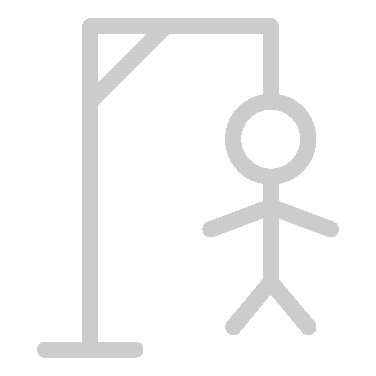

<div align="center">
    
</div>

# HangMan

### Play HangMan with your friends

## Installation

1. Clone the repository

```bash
git git@github.com:DoctorPok42/HangMan.git
```

2. Install dependencies

```bash
npm install
```

3. Run the project

```bash
npm run dev
```

## Usage

1. Go to http://localhost:3000

2. Try to guess the word letter by letter

3. Have fun

### Words

- [Word List](https://random-word-api.herokuapp.com/all)

## Tech

- [Next.js](https://nextjs.org/)
- [TS](https://www.typescriptlang.org/)
- [SASS](https://sass-lang.com/)
- [Material UI](https://material-ui.com/)

## Folder structure

- **components** - Contains all the components used in the project
- **pages** - Contains all the pages used in the project
- **public** - Contains all the static files used in the project
- **styles** - Contains all the styles used in the project
- **api** - Contains all the routes api used in the project

## License

[MIT](https://github.com/DoctorPok42/HangMan/blob/main/LICENSE)

